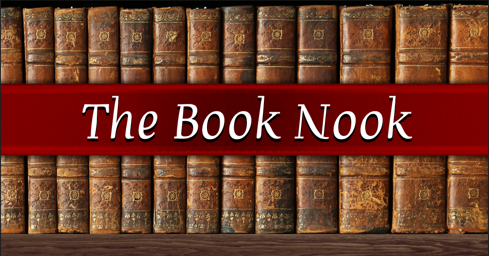

<h1 align="center"> The Book Nook </h1>

| Add Live Link Here |

<h1 align="center"> Introduction: </h1>

The Book Nook is my last assessed portfolio project developed as part of the Code Institute Full Stack Software Developer Bootcamp, consisting of learning outcomes to utilise HTML5, CSS3 & Bootstrap, Django in order to fulfil the necessary requirements for the brief.

The live project can found here: ADD LINK HERE

<h2 align="center"> Table of Contents:</h2>

## Project Outline

The Book Nook is a fictional library harnessing Django. The website primary use is to access information on published books and make reviews, as my MVP. However my extended goal is to have it function fully as online library with adding features such as having the ability to read the books online, having author accounts that can publish theyre books with ease and the admin can review the content before allowing to be released to the main site. I'm aiming to have it so that the users can hide specific topics, authors or books that they'd not like to see on their pages, so the website is fully customised to the user. 

#### Key Objectives

 - A clear and easy to navigate website,
 - The ability for users to Create, Read, Update and Delete book reviews,
 - A large collection of books for Users to review.
 - I want it to be fully responsive across various sizes, especially phone and tablet due to that being more practical for reading.
 - I want the website to be customizeable for logged in Users.

## UX Design

### User Stories

- As a Reader,
  I would like to purchase books directly from the website,
  So that I can easily obtain books I want to read.

  For this to be done, these goals need to be met:

    - Books should have clear pricing.
    - Purchased books should be accessible from a user’s library.
    - The books purchased should be viewable from the account purchase history,

- As a Reader,
  I would like to leave reviews on books
  So that I can share my opinions and help others decide whether to read a book.

  For this to be done, these goals need to be met:

    - A review system must be implemented with a rating system (e.g., stars, thumbs up/down).
    - Users must be able to write, edit and delete reviews.
    - Reviews should be visible on the book’s page.
    - When reviews are deleted they should be notified.

- As a New User,
  I would like to be able to create an account that matches me
  So that I can See things appropriate for my age.

  For this to be done, these goals need to be met:

    - Two main reader accounts i.e. Child and Adult available at account creation,
    - Create an account Page, Sign in and Account Pages.

- As a Reader,
  I would like to create a Wishlist of books
  So that I can keep track of books I want to read or buy later.

  For this to be done, these goals need to be met:

    - Users should be able to add books to a personal Wishlist,
    - The Wishlist should be accessible from a Users personal Library,
    - When a User purchases a book it gets removed from the wishlist,

- As a Reader,
  I would like personalised homepage
  So that I can easily find books that match my interests.

  For this to be done, these goals need to be met:

    - The homepage should recommend books based on previous purchases, Wishlist, and reviews.
    - A section should highlight trending books and new releases.
    - Books should be broken up by genre also.

- As a Admin,
  I would like to have a quick overview of important statistics
  So that I can provide a more optimal service to the customers.

  For this to be done, these goals need to be met:

    - Total User count available through admin,
    - Total Book Count,
    - Total Author Count,

### Color Design

For this project I have mimicked a previous project I completed on a similar topic to help speed up time, I have chosen simple reds to mimic old fashioned ribbon bookmarks. I have used a wooden background to mimic the back of a library shelf with the actual shelves themselves having shelf images. The design of this webpage is to represent an actual library bookshelf but digitally.

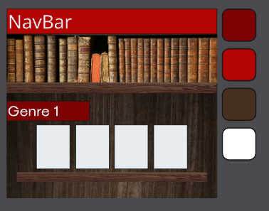
This is the original design plan.

## Wireframes

These wireframes have been created using Balsamiq to define the key feature layout to guide the user experience design as well as blocking out the rough color pallete to identify any key issues. I will be utilising Bootstrap's framework to help blockout the website key elements. 

#### Index Page

This is the home page. I wanted it so that you can see a full genre list of titles as well as having two customised shelves at the top. 

Recommended shows the user what it recommends based on their current reading list it will take into account what is their current favourite genre, author and if theyve hidden any topics, authors or books so that it will only display books that will interest the user without any of the topics, books or authors that might have come up within that query.

Most popular is less specific to the user and more specific to the site, it shows what is currently 'trending' on the site. So it will display books with high ratings, high wishlists and high currently reading. This allows the user to see what other readers are currently interested in. 

#### Search Page
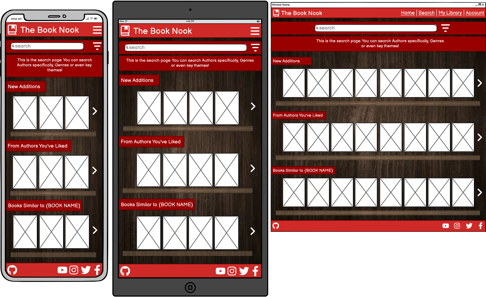

This page I wanted it so that user can get even more customised shelves pre-search.

New additions is customised to the site more than the user, this is to advertise recent additions to the site that wouldnt necessairly show up through recommended or most popular, due to the lack of reviews, wishlists or currently reading as they are new to the site.

From Authors you've liked section takes in account your reviews and Authors who you've read a larger percentage of their books. This is so you can see if an author you've liked has any more works for the user to read.

Books similar to {{Book Name}} would work by finding out what book the user has read and enjoyed and display books that are within that books genre and contain similar topics to the book listed.

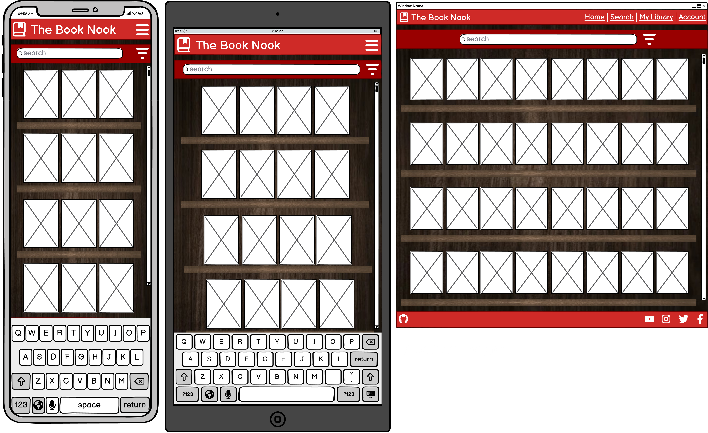

After Search it will display the books that match the search. Ie if you search for fantasy books it will display all fantasy books in the database bar the books that contain any of the three hide-able characteristics so that viewers can avoid topics that they might find triggering or simply dislike.

#### My Library
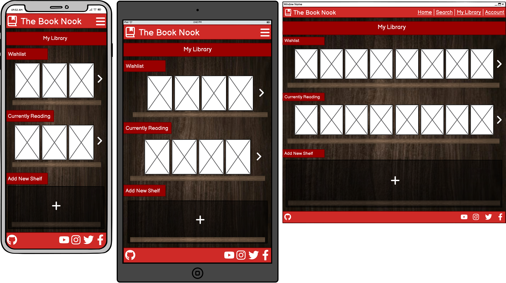

This is the users personaly library shelves that they can customise as they want. 

The Wishlist shelf is for books that the user would like to purchase at a future date. This is automatically added when the player clicks the heart icon on the book page. 

Currently Reading would display books that have been purchased.

Add a new shelf is where the user customisation comes in, they can create a new shelf and customise its title ie to 'Finished' and books they have finished can now be selected and moved to that shelf manually. This is another part of the project that is a 'Could Have' using the 'MoSCow' Method.

#### My Account (Admin, Author, Regular User)
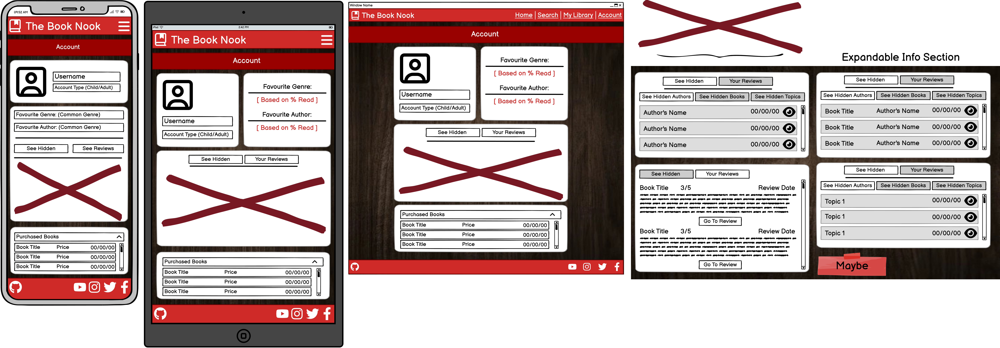

This is the account information page for a Regular User, it will show the username and account type (Could Have Feature). As well as theyre favourite genre as depicted above by the % they've read of that genre so if out of 10 books 7 of those are fantasy, fantasy would become the favourite genre. The same calculation would go for depicting the Users favourite Author.

The next section is where the users hidden topics, authors, books can be seen as well as a collection of all the users reviews. The reviews are shown by default on page loading. 

When you select see hidden another page element is shown below which shows the three options Authors, Books and Topics. If you click Authors you can see the authors name, the date hidden and a fav-icon to unhide the author, Hidden Books is similar except it also shows the Book title as well as the three other elements listed before. Hidden topics shows the Topic name, date hidden and a fav-icon to unhide the topic.

The review section shows the title of the book the review was on, your rating out of 5, the date of the review and the main text of the review paired with a go to review button that will take the User to that review so that they can edit it or delete it.

Lastly, is the list of purchases so that the user has an itemised list of all books purchased, the price they paid and the date of purchase.

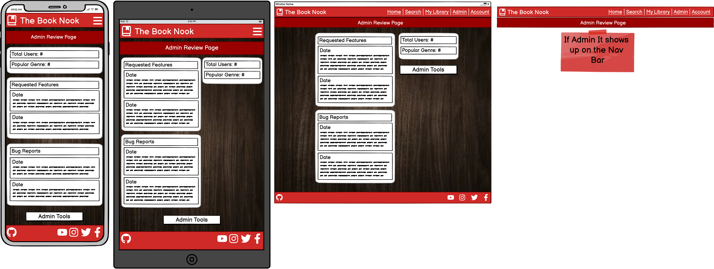

This is what an Admin would see on their account page. It is more buisness focused showing statistics on the total user count to see how the website is doing in terms of popularity, the popular genre so the admin knows what genre of books is currently the most popular. This would aid in what they would add to the site to satisfy the largest consumer base.

It also displays the recent requested features by the Users, so the admin knows what the site is missing and what could be improved upon.

The last section is the recent Bug Reports section, which showcases recent bug reports so that the admins can keep up with maintanence and keep the site bug free.

Lastly, is the 'Admin Tools' button which takes the admin straight to the indepth admin tools ie the Django Backend Admin panel. This makes the site more userfriendly for the less technically minded Admins.

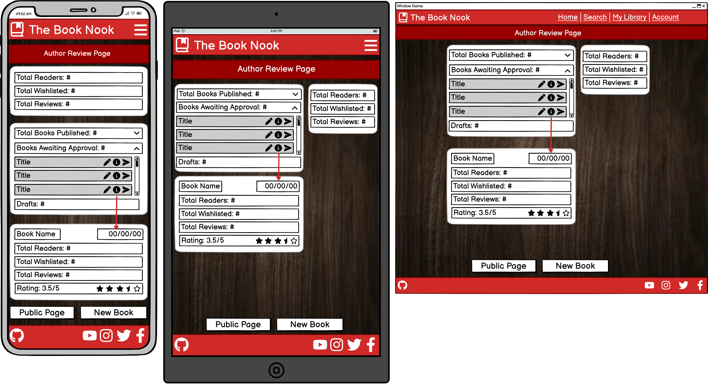

This is what the Authors would see on their Account page, It gives them quick and easy to understand statistics about their Books performance on the site. 

The top section shows the total reader that have currently purchased their book through the site, the total amount of users who have the authors books wishlisted as well as the total reviews on the site across all books. 

The other section is comprised of three dropdown tables, the first for published books, the second for Books that are awaiting admin approval and lastly the drafts. The first drop down showcases the total amount of published books in numerical form and once clicked would drop down a list with the book title and two fav-icons one for extra information and one to take the author to that books store page. The extra information you would get about that book would be the date it was published on the site, How many users have purchased the book and wishlisted it. As well as total reviews and the average rating across all of those reviews. The middle drop down for books awaiting follows a similar pattern, except the extra information fav-icon shows the status of the books awaiting approval and the other icon would take the author to its draft form to review. The draft dropdown is the same as the previous two except the extra information icon is swapped for the edit icon as since its not been submitted to the admin team it can still be edited. An example of the extra information can be found below, for the purchased books.

#### Author Public Profile
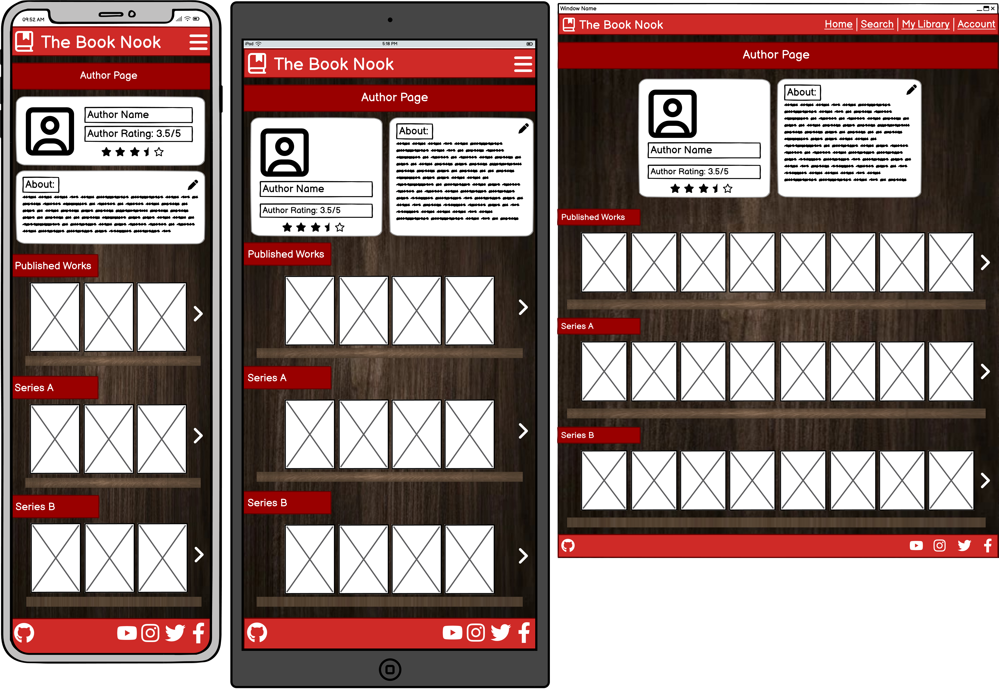

This is the customisable Public Profile for Authors that is connected to their book pages. It shows the authors name and the authors rating which is the average rating on each of their published books. As well as a small Bio about the author. This is customiseable through their account page.

The Published works shelf shows the whole collection of works published by the author. 

Series A is an automtically created shelf for the author that showcases books that are within a series. 

Series B is exactly the same as above but showcases books that are in a different series, ie one shelf per series. These shelves would be hidden if the author didnt have any published books within a series yet. For example if they have book 1 out of 3 published and have not yet publsihed the second the Series bookshelf would not show up until they published the second book and connected the two together.

#### Book Page
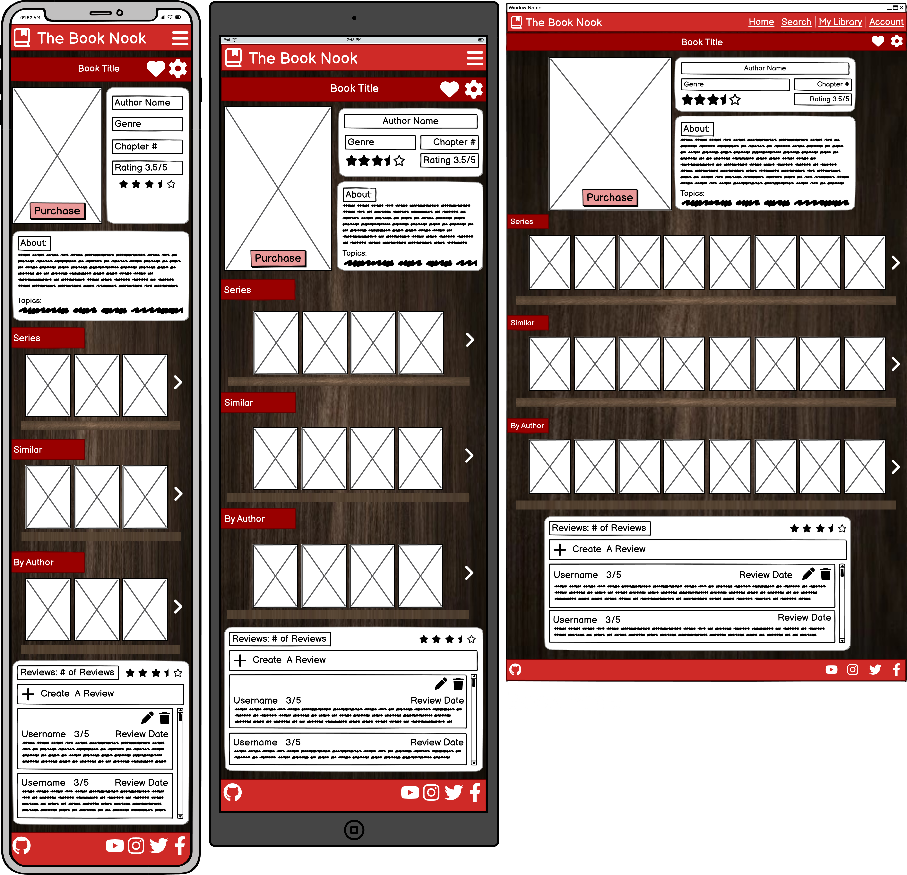

This is what the Users see when they click the covers displayed on the shelves. It will show the Book title in the ribbon at the top of the page with the Fav-Icons for the wishlist (Heart) the settings (Cog). The settings icon would pop up a model which shows the options to hide the Book, Author and to select topics out fo the list to hide.

Below is the Book Cover with a Purchase button which will display the price set by the author. As well as in the other box it shows the Author's name, the genre of the book, how many chapters it has as well as the average rating shown in stars and numerically. 

The box below is a short about of the book usually a condensed version of the blurb. As well as underneathe includes the topics the author has selected from a list.

Similar to the author public profile, the series shelf only appears if this books is apart of a published series. 

The similar shelf, shows books that have the same genre and topics, once again minus any of the hidden catagories. 

The By Author shelf is a replica of the Published works shelf on the author page minus any of the hidden catagories. 

The review section has the amount of reviews published and the average star rating for that book. Create a review drops down the form which allows the user to give the books a rating, title and review text and submit it. It will then display at the top for the user to then access to edit or delete the review. Below in scroll format is other Users reviews.

#### Author Publish Page
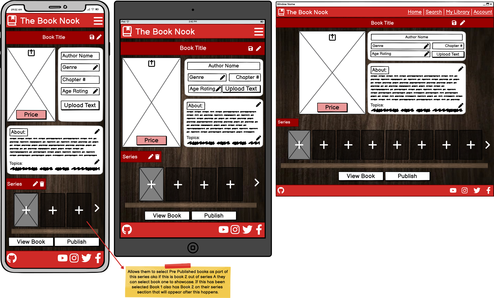

This is another part of the project that is a 'Could Have' using the 'MoSCow' Method. This is the Author book creation page that the author fills out to publish a new book, they can upload their own book cover and fill out all the information necessary like price, genre, age rating, the about and the topics. Then they would upload their a PDF of their book through the upload text button. If the book being published is the second book of a series they then can connect the books together by selecting the book through the shelf, if no book is selected it doesnt become part of a series. The view Book shows the book pages as a reader you will see below and publish would set the book as a un-editable draft for admin's to review.

#### Book Reading Page
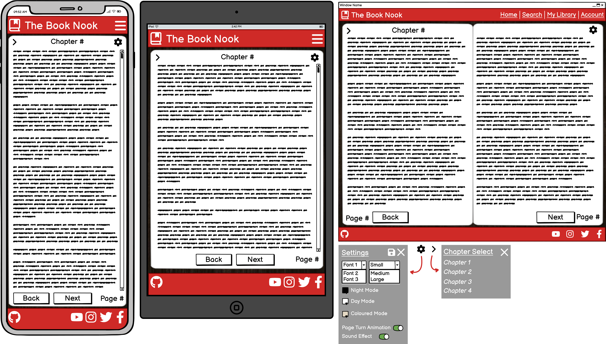

This is another part of the project that is a 'Could Have' using the 'MoSCow' Method. This is the reading section of the project where once you've purchased the books, you can read the books. The data would be saved to the profile so you can leave a book and it'll remember where you are so the user can pick it straight up right where they left off. They also have a lot of accessibility functions like changing the font size, the page mode and wether or not they would like the page turn effect and sound effects. 

## Imagery

In terms of imagery in this website it is going to be minimal, this is due to the fact that the main focus should ideally be on the book covers themselves. Due to the amount of covers going to be visible on a device at a time if the page has too many visual elements outside of whats necessary i feel like it would quickly overwhelm the user. 

Any extra images, aka a hero image, should be simplistic and complementary to the theme. 

Book Cover Credits: 
Each book cover is designed by seperate artists, They are used for educational purposes (aka this project).

Hero Image:
The hero image is a free image hosted on Adobe Stock images by RPL-Studio.

## Features
#### General Features
In order to fulfil the criteria set out by the user stories, listed above, the page will consist of various sectioned information each with a variety of links, resources or other elements that contribute to the website fullfilling its goals and aiding the user. 

Upon coding the projectand implementing the Bootstrap Framework the features the design shifted slightly from the original wireframes.
Some key adjustments are as follow:
- The removal of the Book Purchase date on account due to it on page load defaulting to today's date.
- The Fav-icons on the individual book store pages being move to opposite sides of the title due to on mobile it was hard to press the one you would like and not the other icon.
- The ability to create your own shelf and move books between shelves as it became over-complicated for my first time using Django and for the shelves to be saved it had to be part of a model and then display correctly.
- I also had to relocate the recommended shelf from the index.html to the search due to the amount of shelves causing some optimazation issues.

#### Index Page
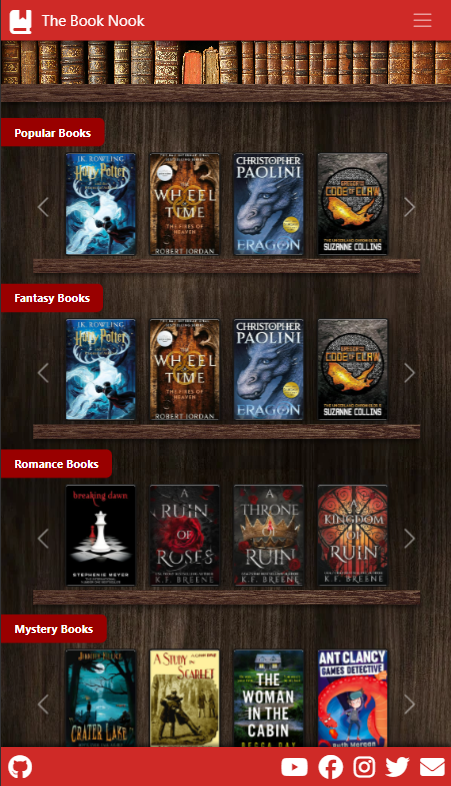

This is the final version of the website. This is the index. I am overall really happy with how it came out and how quick the website is to run despite over 60+ books being loaded. 

#### Search Page
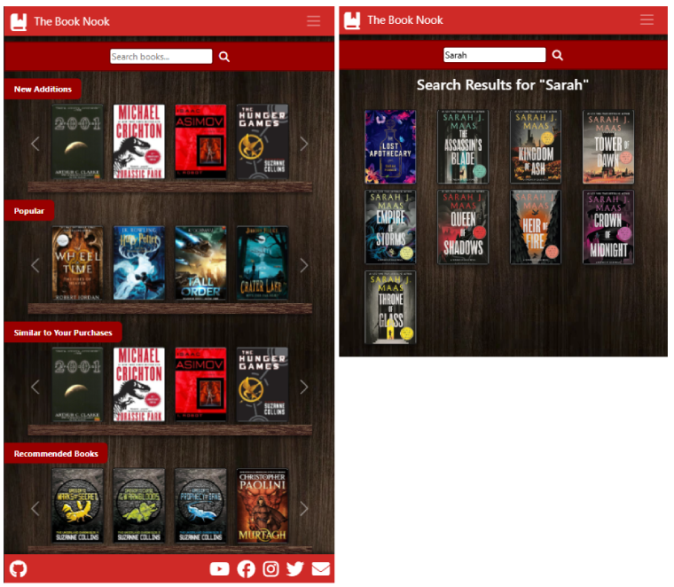

This is the final search page which turned out really well and for my first time coding a search bar into any of my websites im surprised with how well it functions. 

## Responsive Design

I will be utilising the Bootstrap Framework to speed up my effeciency when it comes to media queries and the overall project. With some experimentation I have been able to create a page that is fully responsive to modern standards with the use of media queries and a JavaSript script for the shelves due to Bootstraps carousels causing some technical glitches that would take the project away from my wireframes. 

Below is an image of my website from different devices.

INSERT IMAGE!!!

## AI Implementation

#### Use Cases and Reflections:
#### - Code Creation
  - I used AI like copilot to help implement and generate elements from bootstrap without having to source it from bootstraps website. This sped up creation time exponentially in a project where time is limited.
  - I used it to generate code that .

#### - Debugging 
  - I used Copilot to fix or change elements of my own code to make them more aligned with the websites vision. This was a useful time saving technique which if nto used could have taken hours of research to fix/edit manually.

#### - Overall Impact
  - AI tools streamlined repetive tasks and basic jobs, enabling me to focus on the more complex elements of the development. (Same goes for the Bootstrap elements)

